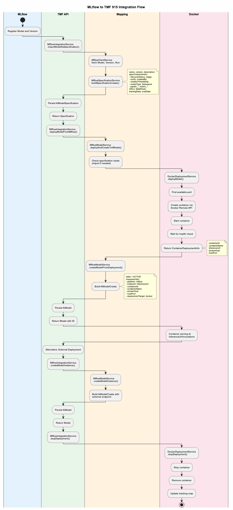

# MLflow Integration for TMF 915 AI Model Management

This module provides client services for integrating MLflow with the TMF 915 AI Model Management API.

## Overview

The MLflow integration provides internal services that can be used by other components to:

- Import MLflow models as `AiModelSpecification` entities
- Create `AiModel` instances from specifications
- Deploy models to remote Docker hosts
- Query the MLflow registry
- Download model artifacts

## Architecture

```
┌─────────────────────────────────────────────────────────────────┐
│                        MLflow Registry                          │
│  ┌─────────────┐  ┌─────────────┐  ┌─────────────┐              │
│  │ Model A v1  │  │ Model A v2  │  │ Model B v1  │  ...         │
│  └─────────────┘  └─────────────┘  └─────────────┘              │
└──────────────────────────┬──────────────────────────────────────┘
                           │ Import (via MlflowIntegrationService)
                           ▼
┌─────────────────────────────────────────────────────────────────┐
│                   AiModelSpecification                          │
│  ┌─────────────┐  ┌─────────────┐  ┌─────────────┐              │
│  │ Spec A v1   │  │ Spec A v2   │  │ Spec B v1   │  ...         │
│  │ (Blueprint) │  │ (Blueprint) │  │ (Blueprint) │              │
│  └─────────────┘  └─────────────┘  └─────────────┘              │
└──────────────────────────┬──────────────────────────────────────┘
                           │ Deploy (Docker) or Register External
                           ▼
┌─────────────────────────────────────────────────────────────────┐
│                        AiModel                                  │
│  ┌─────────────┐  ┌─────────────┐  ┌─────────────┐              │
│  │ Instance 1  │  │ Instance 2  │  │ Instance 3  │  ...         │
│  │ (Docker)    │  │ (External)  │  │ (Docker)    │              │
│  └─────────────┘  └─────────────┘  └─────────────┘              │
└─────────────────────────────────────────────────────────────────┘
```


| Concept                 | TMF Entity             | Description                                                |
| ----------------------- | ---------------------- | ---------------------------------------------------------- |
| **Model in MLflow**     | -                      | A registered model with versions, artifacts, and metadata  |
| **Model Specification** | `AiModelSpecification` | Blueprint describing a model's capabilities and attributes |
| **Model Instance**      | `AiModel`              | A running/deployed instance of a model                     |



## Java API Usage

### Inject the Services

```java
@Autowired
private MlflowIntegrationService mlflowService;

@Autowired
private MlflowClientService mlflowClient;

@Autowired
private MlflowSpecificationService specificationService;

@Autowired
private MlflowModelService modelService;

@Autowired
private MlflowDeploymentService deploymentService;
```

### Import Model as Specification

```java
// Import a model from MLflow as an AiModelSpecification
AiModelSpecification spec = mlflowService.importModelAsSpecification("fraud-detector", "3");

// Import latest version
AiModelSpecification spec = mlflowService.importModelAsSpecification("fraud-detector", null);

// Import all versions of a model
List<AiModelSpecification> specs = mlflowService.importAllVersionsAsSpecifications("fraud-detector");

// Sync all models from MLflow
List<AiModelSpecification> specs = mlflowService.syncAllModels();
```

### Deploy Model to Docker

```java
// Deploy a model to Docker (auto-assigns port)
AiModel model = mlflowService.deployModelFromMlflow("fraud-detector", "3");

// Deploy on a specific port
AiModel model = mlflowService.deployModelFromMlflow("fraud-detector", "3", 5001);

// Deploy to a custom Docker host
AiModel model = mlflowService.deployModelToHost(
    "fraud-detector", "3", 
    "custom-docker-host.example.com", 2375, 5001);

// Check if deployed
boolean deployed = mlflowService.isModelDeployed("fraud-detector", "3");

// Get deployment URL
String url = mlflowService.getDeploymentUrl("fraud-detector", "3");

// Stop deployment
mlflowService.stopDeployment("fraud-detector", "3");
```

### Create Model Instance (External Deployment)

```java
// Register an externally hosted model
AiModel model = mlflowService.createModelInstance(
    specificationId, 
    "instance-name", 
    "http://external-inference-url/invocations"
);
```

### Query MLflow Registry

```java
// List all registered models
List<String> models = mlflowService.listMlflowModels();

// Check if model exists
boolean exists = mlflowService.modelExistsInMlflow("fraud-detector");

// Get model URL in MLflow UI
String url = mlflowService.getMlflowModelUrl("fraud-detector", "3");

// Get tracking URI
String trackingUri = mlflowService.getMlflowTrackingUri();

// List artifacts
List<String> artifacts = mlflowService.listArtifacts("fraud-detector");

// Download artifact
File artifact = mlflowService.downloadArtifact("fraud-detector", "model_card.md");
```

### Low-Level MLflow Client

```java
// Get registered model info
RegisteredModel model = mlflowClient.getRegisteredModel("fraud-detector");

// Get model version
ModelVersion version = mlflowClient.getModelVersion("fraud-detector", "3");

// Get latest version
ModelVersion latest = mlflowClient.getLatestModelVersion("fraud-detector");

// Get production version
Optional<ModelVersion> prod = mlflowClient.getProductionVersion("fraud-detector");

// Get staging version
Optional<ModelVersion> staging = mlflowClient.getStagingVersion("fraud-detector");

// Get all versions
List<ModelVersion> versions = mlflowClient.getModelVersions("fraud-detector");

// Get run data (metrics, params, tags)
Run run = mlflowClient.getRun(runId);
```

---

## MLflow to TMF 915 Mapping

### MLflow → AiModelSpecification


| MLflow Source                     | AiModelSpecification Field              | Notes                             |
| --------------------------------- | --------------------------------------- | --------------------------------- |
| `RegisteredModel.name`            | `name`                                  | Model name                        |
| `ModelVersion.version`            | `version`                               | Version number                    |
| `RegisteredModel.description`     | `description`                           | Falls back to version description |
| `ModelVersion.status`             | `specCharacteristic[lifecycleStatus]`   | PENDING_REGISTRATION, READY, etc. |
| `ModelVersion.current_stage`      | `specCharacteristic[stage]`             | None, Staging, Production         |
| `ModelVersion.run_id`             | `specCharacteristic[runId]`             | Link to training run              |
| `ModelVersion.source`             | `specCharacteristic[artifactUri]`       | Model artifact location           |
| `ModelVersion.user_id`            | `specCharacteristic[createdBy]`         | User who created the version      |
| `ModelVersion.creation_timestamp` | `specCharacteristic[creationTimestamp]` | Creation timestamp                |
| `Run.data.params[]`               | `specCharacteristic[param_*]`           | Hyperparameters                   |
| `Run.data.metrics[]`              | `specCharacteristic[metric_*]`          | Training/eval metrics             |

### MLflow → AiModel


| Source                   | AiModel Field                 | Notes                         |
| ------------------------ | ----------------------------- | ----------------------------- |
| AiModelSpecification     | `aiModelSpecification`        | Reference to blueprint        |
| `{modelName} v{version}` | `name`                        | Instance name                 |
| Always                   | `state`                       | ACTIVE for deployed instances |
| Deployment URL           | `characteristic[endpoint]`    | Inference API URL             |
| Docker container ID      | `characteristic[containerId]` | For Docker deployments        |
| Docker host              | `characteristic[dockerHost]`  | Where container is running    |
| Host port                | `characteristic[hostPort]`    | Exposed port                  |

---

## Docker Deployment

The integration supports deploying MLflow models as Docker containers on remote Docker hosts.

### Prerequisites

- Docker daemon on remote host with TCP API enabled
- MLflow tracking server accessible from the Docker host
- MLflow Docker image available on the remote host

### How It Works

1. **Create Container**: Uses Docker Remote API to create a container running `mlflow models serve`
2. **Start Container**: Starts the container and waits for it to become healthy
3. **Track Deployment**: Stores container info for lifecycle management
4. **Create AiModel**: Records the deployment as a TMF 915 AiModel

### Container Management

```java
// Check if model is deployed
boolean deployed = deploymentService.isDeployed("fraud-detector", "3");

// Get deployment info
DeploymentResult deployment = deploymentService.getDeployment("fraud-detector", "3");

// Stop and remove container
deploymentService.stopDeployment("fraud-detector", "3");
```

---

## Configuration

Add to `application.yml`:

```yaml
mlflow:
  enabled: true
  host: "127.0.0.1"
  port: 5000
  
  # Docker deployment configuration
  docker:
    enabled: true
    host: "docker-host.example.com"    # Remote Docker host IP/hostname
    port: 2375                          # Docker API port (default: 2375)
    tls-enabled: false                  # Enable TLS for secure connections
    image: "ghcr.io/mlflow/mlflow:v2.10.0"  # MLflow Docker image
    container-port: 5001                # Starting port for model containers
    startup-timeout-seconds: 120        # Max wait time for container startup

aimodel:
  specification:
    default-lifecycle-status: Active
```

---

## Service Components


| Service                      | Responsibility                                                             |
| ---------------------------- | -------------------------------------------------------------------------- |
| `MlflowConfiguration`        | Spring beans for MLflow client (conditional on`mlflow.enabled=true`)       |
| `MlflowClientService`        | Low-level MLflow API operations (models, runs, experiments, artifacts)     |
| `MlflowDeploymentService`    | Facade for Docker deployment operations                                    |
| `DockerDeploymentService`    | Low-level Docker Remote API operations for container management            |
| `MlflowSpecificationService` | Converts MLflow models → AiModelSpecification                             |
| `MlflowModelService`         | Creates AiModel instances from specifications, orchestrates Docker deploys |
| `MlflowIntegrationService`   | High-level orchestration API (main entry point)                            |

---

## References

- [MLflow Documentation](https://mlflow.org/docs/latest/index.html)
- [MLflow Java API](https://mlflow.org/docs/latest/api_reference/java_api/org/mlflow/tracking/MlflowClient.html)
- [MLflow Model Registry](https://mlflow.org/docs/latest/model-registry.html)
- [MLflow Model Serving](https://mlflow.org/docs/latest/models.html#serving-mlflow-models)
- [Docker Remote API](https://docs.docker.com/engine/api/)
- [TMF 915 Specification](https://www.tmforum.org/resources/specification/tmf915-ai-ml-model-management-api/)
